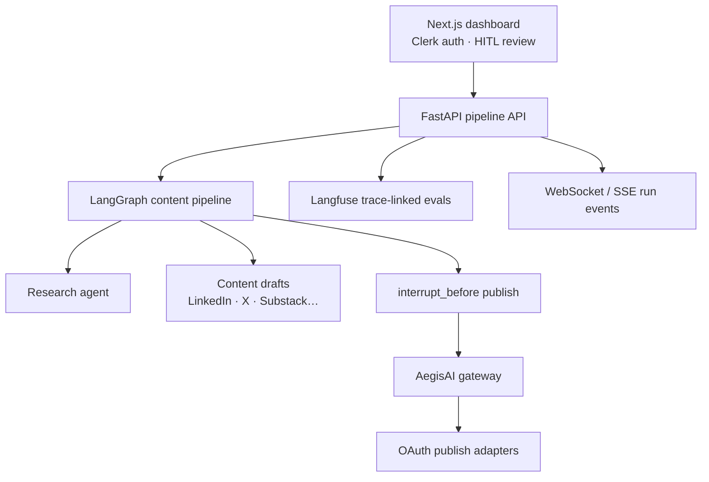
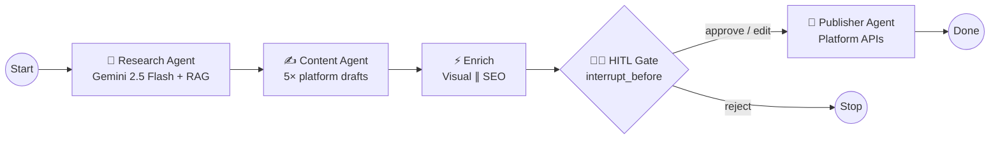

# AI Content Factory


<!-- vpeetla-tech-stack:start -->
[]() []() []() []() []() []() []() []() []()
<!-- vpeetla-tech-stack:end -->
[](https://ai-content-factory-iota.vercel.app)
[](LICENSE)
[](https://venkat-ai.com/work)

**Turn one topic into platform-ready content for LinkedIn, Substack, Medium, Instagram & X — with human approval before anything goes live.** Real auto-publish today covers LinkedIn and X; the other three return a copy-ready draft (no public posting API exists for Substack/Medium, and Instagram requires Meta app review — see [docs/PRODUCT.md](docs/PRODUCT.md)).

> Not another ChatGPT wrapper. A production multi-agent pipeline with RAG, human-in-the-loop gates, full observability, and CI/CD to Render + Vercel.

[🚀 Try the live demo](https://ai-content-factory-iota.vercel.app) · [📖 Production deploy](docs/DEPLOYMENT.md) · [🐛 Report an issue](https://github.com/vpeetla-ai/ai-content-factory/issues) · [🤝 Contribute](CONTRIBUTING.md)

---

## Why this exists

Most "AI content tools" are single-prompt generators. Real teams need:

- **Specialized agents** (research, writing, SEO, visuals) — not one monolithic LLM call
- **Human-in-the-loop (HITL)** before publishing to any platform
- **Observability** (LangSmith, Langfuse, Sentry) when agents fail silently
- **Deployable architecture** on a free-tier cloud stack (Render, Vercel, Neon, Upstash)

This repo is a reference implementation for that stack.

**Product framing:** [docs/PRODUCT.md](docs/PRODUCT.md) — who we serve, trade-offs, success metrics.

**Portfolio:** [Case study](https://github.com/vpeetla-ai/ai-architecture-portfolio/blob/main/case-studies/ai-content-factory.md) · [Architecture](docs/ARCHITECTURE.md) · [Org README standard](https://github.com/vpeetla-ai/ai-architecture-portfolio/blob/main/docs/README_STANDARD.md)

---

## 60-second overview

```text
Topic → Research Agent (RAG) → Content Agent (5 platform drafts)
      → SEO + Visual (parallel) → HITL Review → Publisher → Live
```

<!-- Replace with your recording: docs/assets/demo.gif -->


| | Local | Production |
|---|-------|------------|
| **Frontend** | Next.js :3000 | Vercel |
| **Backend + Agents** | FastAPI + LangGraph :8000 | Render (Docker) |
| **Auth** | Dev bypass or Clerk | Clerk (required) |
| **Observability** | Postgres traces + in-process spans | LangSmith + Langfuse + Sentry (trace-linked) |

**Full deployment guide:** [docs/DEPLOYMENT.md](./docs/DEPLOYMENT.md) — step-by-step setup for Render, Vercel, Clerk, Neon, Upstash, Qdrant, LangSmith, Langfuse, and Sentry.

---

## Quick start (local)

```bash
cp .env.example .env
cp .env.local.example .env.local
cp frontend/.env.local.example frontend/.env.local

make install
make up                 # postgres + redis + qdrant
make migrate
make api                # terminal 1 → :8000
make frontend           # terminal 2 → :3000
make test               # E2E smoke test
```

Set `MOCK_LLM=false` and add LLM keys in `.env.local` for real provider calls.

### Agent skills (Cursor + Codex)

Org skills live in [vpeetla-ai-skills](https://github.com/vpeetla-ai/vpeetla-ai-skills). This repo includes `.cursor/skills/`, `AGENTS.md`, and `CONTEXT.md`.

```bash
git clone https://github.com/vpeetla-ai/vpeetla-ai-skills.git
./vpeetla-ai-skills/scripts/install.sh --cursor --codex --project .
```

---

## Production deploy (git push → live)

1. **One-time:** Create Render, Vercel, Clerk, Neon, Upstash, Qdrant Cloud accounts
2. **Configure:** Set env vars per [docs/DEPLOYMENT.md](./docs/DEPLOYMENT.md)
3. **GitHub secrets:** `RENDER_DEPLOY_HOOK`, `VERCEL_TOKEN`, `VERCEL_ORG_ID`, `VERCEL_PROJECT_ID`
4. **Push to `main`:** CI runs → Render API deploys → Vercel frontend deploys

```bash
git push origin main
```

---

## Environment files

| File | Used by | Committed |
|------|---------|-----------|
| `.env.example` | Template | ✓ |
| `.env.local.example` | Local template | ✓ |
| `.env.production.example` | Prod template | ✓ |
| `.env` / `.env.local` | Local dev | ✗ |
| Render/Vercel dashboard | Production | ✗ |

Local: `.env.local` overrides `.env`. Production: hosting platform injects env vars (no files).

---

## Architecture

**Implemented (ships today)** — Vercel Next.js + Render FastAPI + LangGraph HITL + AegisAI gateway on publish + Langfuse:



Source: [`docs/diagrams/canonical-architecture.mmd`](docs/diagrams/canonical-architecture.mmd).

**Not shipped:** nine-layer aspirational topology (Cloudflare R2, Celery, mobile, Grafana stack) lives in [`docs/diagrams/target-architecture-aspirational.mmd`](docs/diagrams/target-architecture-aspirational.mmd) for scale planning only — do not treat it as the live demo.

### Agent execution flow (LLD)



---

## Implementation status

| Component | Status |
|-----------|--------|
| LangGraph pipeline + HITL | ✅ Production |
| Redis checkpointer | ✅ |
| Clerk auth (FE + BE JWT verify) | ✅ |
| LangSmith tracing | ✅ (set `LANGSMITH_API_KEY`) |
| Trace-linked spans (system/trace/node) | ✅ | [`vpeetla_observability`](docs/ARCHITECTURE.md#observability) |
| Langfuse LLM traces | ✅ (set `LANGFUSE_*`) |
| Sentry error tracking | ✅ (set `SENTRY_DSN`) |
| Qdrant / Pinecone RAG | ✅ |
| WebSocket auth | ✅ |
| CI/CD (GitHub Actions) | ✅ |
| Pytest (graph + HITL + gateway) | ✅ |
| MCP tool bridge (in-process) | ✅ | See [docs/MCP.md](docs/MCP.md) |
| Render + Vercel deploy | ✅ (configure secrets) |
| Platform publish OAuth | 🟡 LinkedIn/X real; Medium/Substack/IG copy-draft |
| Cloudflare R2 media | 🟡 Config ready, upload pending |
| AegisAI gateway (publish path) | ✅ Wired — `integrations/aegis_gateway.py` |
| LLM gateway plane | ✅ When `LLM_GATEWAY_URL` set — ACF **selects** agent→thesis/tier; [aegis-llm-gateway](https://github.com/vpeetla-ai/aegis-llm-gateway) **enforces+records** (ADR-028/029); HITL/publish gateway unchanged |
| `PRODUCTION_STRICT` fail-closed publish | ✅ Denies publish when gateway unreachable (ADR-024) |
| Public ops metrics API | ✅ | `GET /api/v1/ops/metrics` |
| Golden eval CI gate (graph_hitl) | ✅ | `scripts/run_golden_eval_graph.py` |
| DevSecOps pipeline (Semgrep+Trivy) | ✅ | `.github/workflows/security-scan.yml` |
| AWS reference architectures (×6) | ✅ | `docs/reference-architectures/` + `infra/aws/` |
| Public landing page | ✅ | `/` marketing · `/dashboard` app |

---

## Project structure

```
ai-content-factory/
├── agents/              # LangGraph state machine + 5 agents
├── backend/             # FastAPI microservices
│   ├── app/core/        # config, observability, security
│   ├── app/services/    # pipeline, vector_store, clerk_auth
│   └── scripts/         # production entrypoint
├── frontend/            # Next.js 14 + Clerk
├── docs/DEPLOYMENT.md   # Production setup guide
├── render.yaml          # Render blueprint
├── docker-compose.yml   # Local infra only
└── .github/workflows/   # CI + CD
```

---

## API

Base URL: `/api/v1`

| Method | Path | Description |
|--------|------|-------------|
| GET | `/health` | Service health + integration status |
| POST | `/auth/token` | Clerk JWT → API JWT |
| POST | `/pipelines/run` | Start pipeline |
| GET | `/pipelines/{id}` | Run status |
| GET | `/hitl/{id}/review` | HITL drafts |
| POST | `/hitl/{id}/approve` | Approve + resume |
| GET | `/content/{id}/drafts` | Content drafts |
| GET | `/ops/metrics` | Public anonymized ops metrics (SLO dashboard) |

**Ops & architecture:** [SLO](docs/SLO.md) · [SCALE](docs/SCALE.md) · [DevSecOps](docs/DEVSECOPS.md) · [FinOps](docs/FINOPS.md) · [Reference architectures](docs/reference-architectures/) · [Grade A tracker](docs/PORTFOLIO_GRADE_A.md)

Interactive docs (local only): http://localhost:8000/docs

---

## Interview map

**Business function:** Multi-agent content pipeline — research → drafts → HITL → publish (LinkedIn/X live).

Staff+ prep crosswalk — [playbook](https://github.com/vpeetla-ai/ai-architect-interview-playbook) · [study UI](https://ai-architect-interview-playbook.vercel.app) · [Practice Arena](https://ai-architect-practice-arena.vercel.app) · [org matrix](https://github.com/vpeetla-ai/ai-architecture-portfolio/blob/main/docs/REPO_INTERVIEW_MAP.md). Only entries this repo honestly exercises.

| Category | Entry | Fit |
|----------|-------|-----|
| System design | [Agent tool-use / orchestration](https://ai-architect-interview-playbook.vercel.app/q/ai-system-design/03-agent-tool-use-orchestration-platform/) ([md](https://github.com/vpeetla-ai/ai-architect-interview-playbook/blob/main/ai-system-design/03-agent-tool-use-orchestration-platform.md)) | LangGraph pipeline + gateway publish |
| General SD | [Job scheduler / task queue](https://ai-architect-interview-playbook.vercel.app/q/general-system-design/04-distributed-job-scheduler-task-queue/) ([md](https://github.com/vpeetla-ai/ai-architect-interview-playbook/blob/main/general-system-design/04-distributed-job-scheduler-task-queue.md)) | Partial — cron / pipeline runs |
| General SD | [Notification system](https://ai-architect-interview-playbook.vercel.app/q/general-system-design/08-notification-system/) ([md](https://github.com/vpeetla-ai/ai-architect-interview-playbook/blob/main/general-system-design/08-notification-system.md)) | Partial — post-publish / ops signals |
| Trade-offs | [Cost vs latency vs safety](https://ai-architect-interview-playbook.vercel.app/q/scalability-governance-tradeoffs/01-cost-vs-latency-vs-safety/) ([md](https://github.com/vpeetla-ai/ai-architect-interview-playbook/blob/main/scalability-governance-tradeoffs/01-cost-vs-latency-vs-safety.md)) | HITL vs autonomy; model cost per run |
| Cloud | [LLM gateway / model routing](https://ai-architect-interview-playbook.vercel.app/q/cloud-architecture/07-llm-gateway-semantic-cache-model-router/) ([md](https://github.com/vpeetla-ai/ai-architect-interview-playbook/blob/main/cloud-architecture/07-llm-gateway-semantic-cache-model-router.md)) | Apps select; gateway enforces (ADR-029); publish still via AegisAI |
| Behavioral | [Leading a 0→1 AI product](https://ai-architect-interview-playbook.vercel.app/q/behavioral/05-leading-a-0-to-1-ai-product-build/) ([md](https://github.com/vpeetla-ai/ai-architect-interview-playbook/blob/main/behavioral/05-leading-a-0-to-1-ai-product-build.md)) | Shipped application-layer product story |

## Related projects

| Project | Role |
|---------|------|
| [AegisAI](https://github.com/vpeetla-ai/aegisai-enterprise-agent-platform) | Agent governance control plane — gateway + HITL |
| [aegis-llm-gateway](https://github.com/vpeetla-ai/aegis-llm-gateway) | Shared LLM completions — set `LLM_GATEWAY_URL` |
| [Venkat AI Platform](https://github.com/vpeetla-ai/venkat-ai-platform) | Multi-agent personal OS — Chief orchestrator |
| [Enterprise RAG Platform](https://github.com/vpeetla-ai/enterprise_rag_platform) | Governed RAG reference |
| [Curriculum Agent Patterns](https://github.com/vpeetla-ai/react-agent-pattern) | Teaching stubs — ReAct · Reflection · Plan-Execute · Multi-Agent · Swarm |

Built by [Venkata Peetla](https://github.com/vpeetla-ai) — [venkat-ai.com](https://venkat-ai.com) · [Substack](https://venkatapeetla.substack.com) · [Medium](https://medium.com/@vpeetla.ai)

---

## Contributing

Contributions welcome — see [CONTRIBUTING.md](CONTRIBUTING.md). Look for issues labeled [`good first issue`](https://github.com/vpeetla-ai/ai-content-factory/issues?q=is%3Aissue+is%3Aopen+label%3A%22good+first+issue%22).

If this repo helped you, a ⭐ helps other builders discover it.

---

## License

See [LICENSE](./LICENSE).
