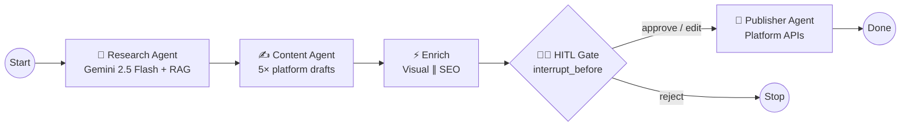

```mermaid
flowchart TB
    subgraph L0["L0 · Client"]
        direction LR
        NEXT["🖥️ Next.js 14<br/>App Router · RSC"]
        SPA["⚛️ React SPA<br/>Vite · shadcn/ui"]
        MOB["📱 Mobile<br/>React Native · Expo"]
    end

    subgraph L1["L1 · Edge / CDN"]
        direction LR
        CF["🌐 Cloudflare CDN<br/>WAF · DDoS"]
        VERCEL["▲ Vercel Edge<br/>ISR · Middleware"]
        AUTH_FE["🔐 Auth Layer<br/>Clerk · JWT · RBAC"]
    end

    subgraph L2["L2 · API Gateway"]
        direction LR
        NGINX["🔀 NGINX / Traefik<br/>TLS · Reverse proxy"]
        RATE["🚦 Rate Limiter<br/>Redis sliding window"]
        LITELLM_GW["🔁 LiteLLM Router<br/>Fallback · Load balance"]
        WS_GW["🔌 WS Gateway<br/>Socket.io · HITL events"]
    end

    subgraph L3["L3 · Backend Services"]
        direction LR
        API_SVC["⚡ API Service<br/>FastAPI · Pydantic v2"]
        PIPE_SVC["🔧 Pipeline Service<br/>LangGraph runner"]
        HITL_SVC["🧑‍💼 HITL Service<br/>Interrupt · Approval"]
        PUB_SVC["🚀 Publisher Service<br/>Platform adapters"]
        AUTH_SVC["🛡️ Auth Service<br/>JWT · API keys"]
    end

    subgraph L4["L4 · Agent Layer"]
        direction LR
        LG["🕸️ LangGraph Engine<br/>StateGraph · Checkpointer"]
        RES["🔬 Research<br/>Gemini Flash"]
        CONT["✍️ Content<br/>Gemini / Haiku"]
        SEO["📈 SEO<br/>Groq Llama 3.3"]
        VIS["🎨 Visual<br/>Groq · img prompts"]
    end

    subgraph L5["L5 · LLM Providers"]
        direction LR
        GEM["✦ Gemini 2.5 Flash"]
        GROQ["⚡ Groq"]
        CER["🧠 Cerebras"]
        HAIKU["◆ Claude Haiku"]
        OLL["🏠 Ollama local"]
    end

    subgraph L6["L6 · Data Layer"]
        direction LR
        PG["🐘 PostgreSQL<br/>Supabase / Neon"]
        REDIS["🔴 Redis<br/>Cache · Queue · State"]
        VEC["🌲 Pinecone / Qdrant<br/>Vector · RAG"]
        R2["🪣 Cloudflare R2<br/>Media assets"]
        LS["🔍 LangSmith<br/>Traces · Evals"]
    end

    subgraph L7["L7 · Publish Targets"]
        direction LR
        LI["💼 LinkedIn"]
        SS["📰 Substack"]
        MD["📝 Medium"]
        IG["📸 Instagram"]
        X["𝕏 X API v2"]
    end

    subgraph L8["L8 · Observability"]
        direction LR
        LF["📊 Langfuse"]
        GRAF["📈 Grafana + Prometheus"]
        SENTRY["🚨 Sentry"]
        OTEL["🔭 OpenTelemetry"]
    end

    L0 -->|"HTTPS · TLS 1.3"| L1
    L1 -->|"Internal VPC"| L2
    L2 -->|"HTTP/2"| L3
    L3 -->|"Celery · Redis Streams"| L4
    L4 -->|"OpenAI-compatible API"| L5
    L4 --> L6
    L3 --> L6
    L3 -->|"OAuth2 · Platform APIs"| L7
    L3 -.->|"Metrics · Traces"| L8
    L4 -.-> L8
    L5 -.-> L8

    style L0 fill:#0e1a2e,stroke:#38bdf8,color:#e2e4f0
    style L1 fill:#1a1408,stroke:#fb923c,color:#e2e4f0
    style L2 fill:#1a0a10,stroke:#ff4d6d,color:#e2e4f0
    style L3 fill:#12101f,stroke:#7c6fff,color:#e2e4f0
    style L4 fill:#0a1a18,stroke:#00e5c3,color:#e2e4f0
    style L5 fill:#14101f,stroke:#a78bfa,color:#e2e4f0
    style L6 fill:#1a1608,stroke:#ffb830,color:#e2e4f0
    style L7 fill:#0a1a12,stroke:#00d68f,color:#e2e4f0
    style L8 fill:#101018,stroke:#5a5a80,color:#e2e4f0
```

# AI Content Factory

[](https://ai-content-factory-iota.vercel.app)
[](LICENSE)
[](https://langchain-ai.github.io/langgraph/)
[]()

**Turn one topic into platform-ready content across LinkedIn, Substack, Medium, Instagram & X — with human approval before anything goes live.**

> Not another ChatGPT wrapper. A production multi-agent pipeline with RAG, human-in-the-loop gates, full observability, and CI/CD to Render + Vercel.

[🚀 Try the live demo](https://ai-content-factory-iota.vercel.app) · [📖 Production deploy](docs/DEPLOYMENT.md) · [🐛 Report an issue](https://github.com/vpeetla-ai/ai-content-factory/issues) · [🤝 Contribute](CONTRIBUTING.md)

---

## Why this exists

Most "AI content tools" are single-prompt generators. Real teams need:

- **Specialized agents** (research, writing, SEO, visuals) — not one monolithic LLM call
- **Human-in-the-loop (HITL)** before publishing to any platform
- **Observability** (LangSmith, Langfuse, Sentry) when agents fail silently
- **Deployable architecture** on a free-tier cloud stack (Render, Vercel, Neon, Upstash)

This repo is a reference implementation for that stack.

---

## 60-second overview

```text
Topic → Research Agent (RAG) → Content Agent (5 platform drafts)
      → SEO + Visual (parallel) → HITL Review → Publisher → Live
```

<!-- Replace with your recording: docs/assets/demo.gif -->


| | Local | Production |
|---|-------|------------|
| **Frontend** | Next.js :3000 | Vercel |
| **Backend + Agents** | FastAPI + LangGraph :8000 | Render (Docker) |
| **Auth** | Dev bypass or Clerk | Clerk (required) |
| **Observability** | Postgres traces | LangSmith + Langfuse + Sentry |

**Full deployment guide:** [docs/DEPLOYMENT.md](./docs/DEPLOYMENT.md) — step-by-step setup for Render, Vercel, Clerk, Neon, Upstash, Qdrant, LangSmith, Langfuse, and Sentry.

---

## Quick start (local)

```bash
cp .env.example .env
cp .env.local.example .env.local
cp frontend/.env.local.example frontend/.env.local

make install
make up                 # postgres + redis + qdrant
make migrate
make api                # terminal 1 → :8000
make frontend           # terminal 2 → :3000
make test               # E2E smoke test
```

Set `MOCK_LLM=false` and add LLM keys in `.env.local` for real provider calls.

### Agent skills (Cursor + Codex)

Org skills live in [vpeetla-ai-skills](https://github.com/vpeetla-ai/vpeetla-ai-skills). This repo includes `.cursor/skills/`, `AGENTS.md`, and `CONTEXT.md`.

```bash
git clone https://github.com/vpeetla-ai/vpeetla-ai-skills.git
./vpeetla-ai-skills/scripts/install.sh --cursor --codex --project .
```

---

## Production deploy (git push → live)

1. **One-time:** Create Render, Vercel, Clerk, Neon, Upstash, Qdrant Cloud accounts
2. **Configure:** Set env vars per [docs/DEPLOYMENT.md](./docs/DEPLOYMENT.md)
3. **GitHub secrets:** `RENDER_DEPLOY_HOOK`, `VERCEL_TOKEN`, `VERCEL_ORG_ID`, `VERCEL_PROJECT_ID`
4. **Push to `main`:** CI runs → Render API deploys → Vercel frontend deploys

```bash
git push origin main
```

---

## Environment files

| File | Used by | Committed |
|------|---------|-----------|
| `.env.example` | Template | ✓ |
| `.env.local.example` | Local template | ✓ |
| `.env.production.example` | Prod template | ✓ |
| `.env` / `.env.local` | Local dev | ✗ |
| Render/Vercel dashboard | Production | ✗ |

Local: `.env.local` overrides `.env`. Production: hosting platform injects env vars (no files).

---

## Architecture

### High-Level Design (HLD)

Nine-layer architecture — free-first stack, multi-agent orchestration with human-in-the-loop (HITL).



### Agent execution flow (LLD)



---

## Implementation status

| Component | Status |
|-----------|--------|
| LangGraph pipeline + HITL | ✅ Production |
| Redis checkpointer | ✅ |
| Clerk auth (FE + BE JWT verify) | ✅ |
| LangSmith tracing | ✅ (set `LANGSMITH_API_KEY`) |
| Langfuse LLM traces | ✅ (set `LANGFUSE_*`) |
| Sentry error tracking | ✅ (set `SENTRY_DSN`) |
| Qdrant / Pinecone RAG | ✅ |
| WebSocket auth | ✅ |
| CI/CD (GitHub Actions) | ✅ |
| Pytest (graph + HITL + gateway) | ✅ |
| MCP tool bridge (in-process) | ✅ | See [docs/MCP.md](docs/MCP.md) |
| Render + Vercel deploy | ✅ (configure secrets) |
| Platform publish OAuth | 🟡 Mock adapters (wire tokens next) |
| Cloudflare R2 media | 🟡 Config ready, upload pending |
| AegisAI gateway (publish path) | 🟡 Integration code; mock publish adapters today |

---

## Project structure

```
ai-content-factory/
├── agents/              # LangGraph state machine + 5 agents
├── backend/             # FastAPI microservices
│   ├── app/core/        # config, observability, security
│   ├── app/services/    # pipeline, vector_store, clerk_auth
│   └── scripts/         # production entrypoint
├── frontend/            # Next.js 14 + Clerk
├── docs/DEPLOYMENT.md   # Production setup guide
├── render.yaml          # Render blueprint
├── docker-compose.yml   # Local infra only
└── .github/workflows/   # CI + CD
```

---

## API

Base URL: `/api/v1`

| Method | Path | Description |
|--------|------|-------------|
| GET | `/health` | Service health + integration status |
| POST | `/auth/token` | Clerk JWT → API JWT |
| POST | `/pipelines/run` | Start pipeline |
| GET | `/pipelines/{id}` | Run status |
| GET | `/hitl/{id}/review` | HITL drafts |
| POST | `/hitl/{id}/approve` | Approve + resume |
| GET | `/content/{id}/drafts` | Content drafts |

Interactive docs (local only): http://localhost:8000/docs

---

## Related projects

| Project | Role |
|---------|------|
| [AegisAI](https://github.com/vpeetla-ai/aegisai-enterprise-agent-platform) | Agent governance control plane — gateway + HITL |
| [Venkat AI Platform](https://github.com/vpeetla-ai/venkat-ai-platform) | Multi-agent personal OS — Chief orchestrator |
| [Enterprise RAG Platform](https://github.com/vpeetla-ai/enterprise_rag_platform) | Governed RAG reference |
| [Production Agent Patterns](https://github.com/vpeetla-ai/react-agent-pattern) | ReAct · Reflection · Plan-Execute · Multi-Agent · Swarm |

Built by [Venkata Peetla](https://github.com/vpeetla-ai) — [venkat-ai.com](https://venkat-ai.com) · [Substack](https://venkatapeetla.substack.com) · [Medium](https://medium.com/@vpeetla.ai)

---

## Contributing

Contributions welcome — see [CONTRIBUTING.md](CONTRIBUTING.md). Look for issues labeled [`good first issue`](https://github.com/vpeetla-ai/ai-content-factory/issues?q=is%3Aissue+is%3Aopen+label%3A%22good+first+issue%22).

If this repo helped you, a ⭐ helps other builders discover it.

---

## License

See [LICENSE](./LICENSE).
