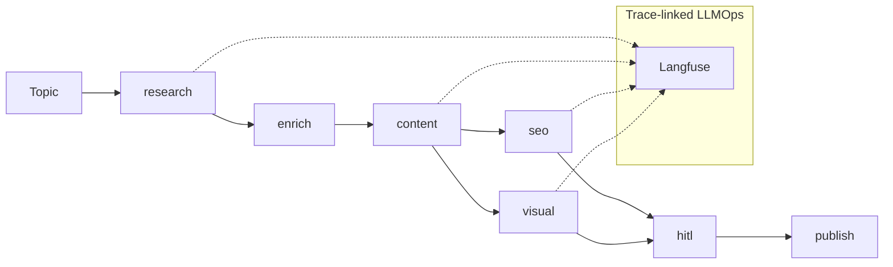

# Architecture — AI Content Factory

Canonical org pattern: [TRACE_LINKED_OBSERVABILITY](https://github.com/vpeetla-ai/ai-architecture-portfolio/blob/main/docs/TRACE_LINKED_OBSERVABILITY.md)

Deploy guide: [DEPLOYMENT.md](./DEPLOYMENT.md) · Product: [PRODUCT.md](./PRODUCT.md)

---

## System context

```text
Next.js (Vercel) ──JWT──► FastAPI (Render) ──► LangGraph pipeline (agents/)
                              │
                              ├── Postgres (runs, traces, HITL)
                              ├── Redis (checkpointer)
                              ├── Qdrant (RAG)
                              └── Observability (LangSmith, Langfuse, Sentry)
```

## LangGraph pipeline



```text
research → enrich → content → [seo ∥ visual] → hitl → publish
```

- **HITL:** `interrupt_before` on publish node — human approves before side effects
- **RAG:** Qdrant hybrid retrieval in research node
- **Gateway:** AegisAI integration on publish path

Graph source: `agents/graph.py` · Nodes: `agents/nodes/`

Note: the graph's `publish` node (`agents/nodes/publish.py`) only decides *which* approved
drafts to attempt per platform. The real per-platform API call happens afterward in
`PipelineService._persist_published` via `PublisherService` (`backend/app/services/publisher.py`).

---

## OAuth connect + publish (ADR-008)

LinkedIn and X are real auto-publish; Medium, Substack, and Instagram are not (see
[docs/PRODUCT.md](./PRODUCT.md#what-we-are-not) and
[ai-architecture-portfolio/adr/ADR-008-real-publish-scope-and-invite-gating.md](https://github.com/vpeetla-ai/ai-architecture-portfolio/blob/main/adr/ADR-008-real-publish-scope-and-invite-gating.md)).

```text
Frontend "Connect" button
  → GET /oauth/{platform}/authorize (Bearer-authed)
      generates CSRF state (+ PKCE verifier/challenge for X), stores in Redis (10 min TTL)
      returns {authorize_url}
  → browser redirects to LinkedIn/X consent screen
  → provider redirects to GET /oauth/{platform}/callback?code&state (no auth header — browser nav)
      looks up state in Redis to recover user_id (+ code_verifier for X), single-use
      exchanges code for access_token, fetches LinkedIn person URN via /v2/userinfo
      stores token (+ person_id) on user.platform_tokens
      redirects back to {frontend_url}/?connected={platform}
```

`PublisherService.publish_draft` receives the full per-platform token dict (not just a bare
access token) so `LinkedInAdapter` can build a real `urn:li:person:{id}` author field —
LinkedIn's UGC API rejects the literal string `"me"`. `MediumAdapter`/`SubstackAdapter`/
`InstagramAdapter` extend `NotSupportedAdapter`, which returns the draft content for the
frontend to offer as a "Copy draft" action instead of a fake published URL.

---

## Observability

Trace-linked spans at **system**, **trace**, and **node** levels via `backend/app/vpeetla_observability/`.

| Signal | Implementation | Env / config |
|--------|----------------|--------------|
| Request trace ID | `TraceRequestMiddleware` | `X-Trace-Id` header or auto-generated |
| Pipeline recorder | `TraceRecorder` in `pipeline.py` | Bound per `run_id` |
| Graph node spans | `@observe_node` on all nodes | `agents/observability.py` |
| LLM generations | Nested under root trace in `agents/llm.py` | Langfuse when keys set |
| LangSmith | LangChain tracing | `LANGSMITH_API_KEY` |
| Langfuse export | `export_trace_summary` + `configure_langfuse` | `LANGFUSE_*` — see [DEPLOYMENT.md §8](./DEPLOYMENT.md#8-step-by-step-langfuse) |
| Sentry | FastAPI integration | `SENTRY_DSN` |
| Postgres audit | `agent_traces` table | Always on when DB configured |

**Production import path:** `from app.vpeetla_observability...` (not top-level `vpeetla_observability`).

---

## Deployment topology

| Component | Local | Production |
|-----------|-------|------------|
| Frontend | Next.js :3000 | Vercel |
| API + agents | FastAPI :8000 | Render (Docker, `render.yaml`) |
| Database | docker-compose Postgres | Neon |
| Cache | docker-compose Redis | Upstash |
| Vector | docker-compose Qdrant | Qdrant Cloud |

Full secrets checklist: [DEPLOYMENT.md](./DEPLOYMENT.md)

---

## Related repos

| Layer | Repo |
|-------|------|
| Governance | [aegisai-enterprise-agent-platform](https://github.com/vpeetla-ai/aegisai-enterprise-agent-platform) |
| Orchestration reference | [venkat-ai-platform](https://github.com/vpeetla-ai/venkat-ai-platform) |
| Portfolio case study | [ai-architecture-portfolio/case-studies/ai-content-factory.md](https://github.com/vpeetla-ai/ai-architecture-portfolio/blob/main/case-studies/ai-content-factory.md) |
