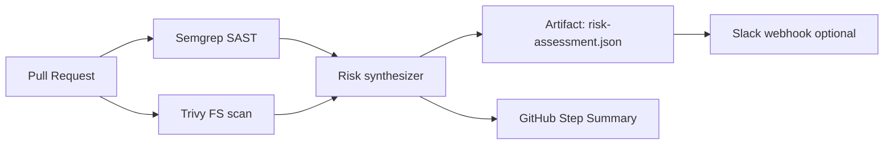

# DevSecOps + AI — Security Pipeline

Build-time security complements runtime governance (AegisAI).

## Architecture

## Workflow

GitHub Actions: [`.github/workflows/security-scan.yml`](../.github/workflows/security-scan.yml)

| Step | Tool | Purpose |
|------|------|---------|
| SAST | Semgrep (`p/python`, `p/secrets`, `p/owasp-top-ten`) | Code + secret patterns |
| Dependency/CVE | Trivy filesystem | Known vulnerabilities |
| Synthesis | `scripts/security_risk_report.py` | Structured risk assessment |

## Risk levels

| Level | Condition | CI behavior |
|-------|-----------|-------------|
| **low** | No CRITICAL/HIGH CVEs, few Semgrep hits | Pass |
| **medium** | MEDIUM CVEs or >5 Semgrep hits | Pass + review |
| **high** | CRITICAL/HIGH CVEs | Pass (default); set `SECURITY_GATE_STRICT=true` to fail |

## LLM synthesis (optional)

Set `GROQ_API_KEY` or `OPENAI_API_KEY` in GitHub secrets to extend `security_risk_report.py` with natural-language executive summary. Rule-based synthesis runs without keys so CI never blocks on missing LLM.

## Runtime vs build-time

| Layer | System | Question |
|-------|--------|----------|
| **Build-time** | This pipeline | Is the code safe to merge? |
| **Runtime** | AegisAI gateway | Is this agent allowed to publish? |

## Historical tracking (roadmap)

Store `risk-assessment.json` snapshots in DynamoDB or Postgres for posture-over-time charts. Pattern documented in [reference-architectures/05-devsecops-ai-pipeline.md](./reference-architectures/05-devsecops-ai-pipeline.md).

## Related

- [AegisAI case study](https://github.com/vpeetla-ai/ai-architecture-portfolio/blob/main/case-studies/aegisai-agent-governance.md)
- [ADR-004 Gateway + HITL](https://github.com/vpeetla-ai/ai-architecture-portfolio/blob/main/adr/ADR-004-gateway-hitl-side-effects.md)
