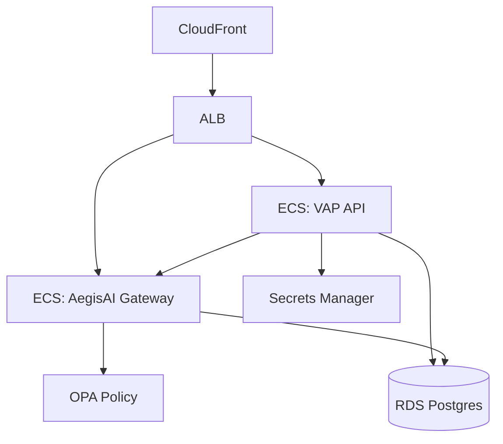

# 01 — Governed Multi-Agent API (AWS)

## Problem

Enterprises need multi-agent orchestration where **side effects are authorized**, not just logged.

## Architecture

## Key decisions

| Decision | Chosen | Rejected |
|----------|--------|----------|
| Orchestration vs governance | Split services (ADR-001) | Monolithic agent |
| Policy engine | OPA sidecar | Inline if/else |
| Compute | ECS Fargate | EKS (overkill at S tier) |

## Cost (USD/month)

| Tier | Components | Est. |
|------|------------|------|
| S | 1× Fargate task each, db.t4g.micro | $80 |
| M | 2× tasks, db.t4g.small, ALB | $350 |
| L | Auto-scale 2–10, Multi-AZ RDS | $1,200 |

## Terraform

See [`infra/aws/01-governed-agents/`](../../infra/aws/01-governed-agents/).
